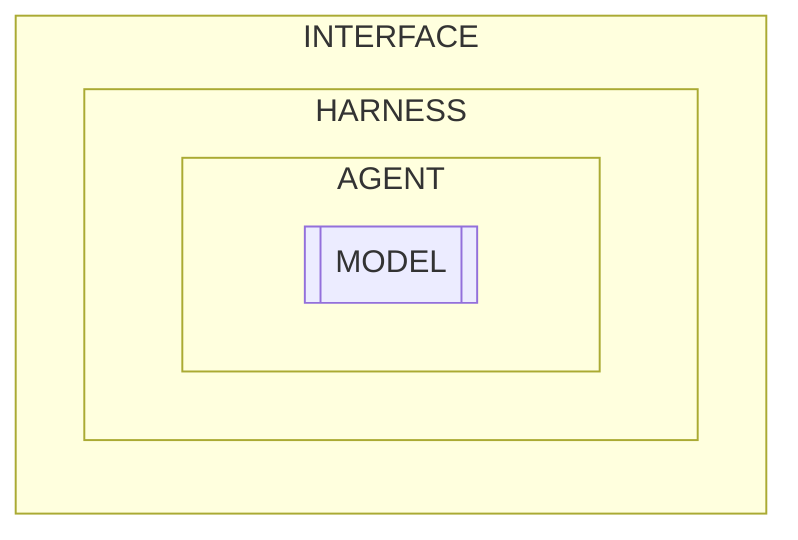
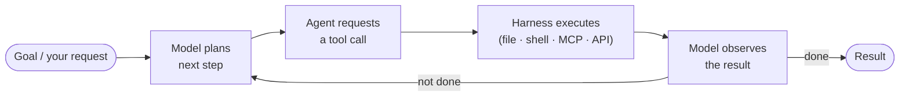

# How to Effectively Use LLMs for Software Development

**Who this is for:** anyone who wants to get better results from AI coding
assistants — whether you write code daily or are just trying to understand how
these tools work. Parts 1 and 2 are conceptual and assume no programming
background. Parts 3 and 4 get more hands-on and use coding examples, but the
ideas behind them apply to anyone directing an AI assistant.

**TL;DR:** An AI assistant is a stack of layers wrapped around a language model
that, by itself, has no memory and only ever sees the information you hand it
each turn. So using one well comes down to a single skill: deliberately control
what goes into that context, keep the noise out, and verify what comes back.
Everything below is that one idea applied in different places.

## Contents

- [Part 1: The Anatomy of an AI Coding Assistant](#part-1-the-anatomy-of-an-ai-coding-assistant) — what the pieces are
- [Part 2: What Makes Each Layer Effective](#part-2-what-makes-each-layer-effective) — how to use each one well
- [Part 3: A Worked Example — Building a Program End to End](#part-3-a-worked-example--building-a-program-end-to-end) — the principles in practice
- [Part 4: Quirks, Tips, and Folklore](#part-4-quirks-tips-and-folklore) — hard-won lessons and gotchas

## Part 1: The Anatomy of an AI Coding Assistant

Before talking about *how* to use an AI assistant effectively, it helps to know
*what you're actually using*. People casually say "the AI" or "the model," but
what you interact with is a stack of distinct components. Knowing which layer
does what makes it much easier to reason about behavior, debug surprises, and
get better results.

There are four core layers — **model**, **agent**, **harness**, and
**interface** — plus three things that shape behavior across them: **system
prompts**, **MCPs**, and **skills**.

### How it all fits together

The stack is easiest to understand as two pictures: **how the layers nest**, and
**how the agent loop runs**.

#### 1. The layers (how the pieces nest)

Each layer wraps the one inside it. You touch the outside; the model sits at the
core.



*Diagram summary: four nested boxes, outermost to innermost — **INTERFACE**
contains **HARNESS**, which contains **AGENT**, which contains the **MODEL** at
the center. You interact with the outside; the model sits at the core.*

| Layer | Role |
|-------|------|
| **Interface** | Where you interact — CLI, IDE extension, web chat |
| **Harness** | Runtime: assembles context, executes tools, enforces permissions |
| **Agent** | The loop: decides what to do, acts, observes, repeats |
| **Model** | The LLM weights — stateless, predicts the next token/action |

#### 2. The agent loop (how a task runs)

Within those layers, work happens as a cycle. The model never acts directly — it
*requests* an action, the harness carries it out and reports back, and the model
decides what to do next.



*Diagram summary: a repeating cycle. Your goal feeds into the model planning the
next step → the agent requesting a tool call → the harness executing it (file,
shell, MCP, or API) → the model observing the result. If the task isn't done, it
loops back to planning; when it's done, it returns the result.*

Each time the model plans, the harness hands it a freshly assembled context:

```
Context assembled every turn:
  ├── System prompt          (persistent rules & persona)
  ├── Conversation history
  ├── Tool / MCP definitions  (what actions are available)
  └── Skills                  (domain knowledge, loaded on demand)
```

### The four core layers

**Model** — The large language model itself: the trained weights (Claude, GPT,
etc.). It is essentially a stateless function — text in, text out. It has no
memory between calls, can't run code, and can't read your files on its own. On
its own it only predicts the next token (a *token* is a chunk of text — roughly
a word or word-fragment — that the model reads and writes one at a time).
Everything else in the stack exists to
give that prediction *something useful to act on*.

**Agent** — The control loop wrapped around the model that turns prediction into
action. The agent gives the model a goal, lets it choose a tool, observes the
result, and feeds that back so the model can decide the next step — repeating
until the task is done. "Plan → act → observe → repeat" is the agent, not the
model.

**Harness** — The runtime scaffolding that makes the agent loop actually work.
It assembles the context sent to the model each turn, executes the tool calls
the model requests, enforces permissions and safety rules, and tracks session
state. When a tool runs, a file gets written, or context gets compacted, that's
the harness — the plumbing between the model's intentions and the real world.

**Interface** — The surface you interact with: a terminal CLI, an IDE
extension, or a web chat window. The same underlying agent and model can be
exposed through very different interfaces. The interface shapes *your*
experience (how you see diffs, approve actions, view output) but isn't where the
reasoning happens.

> A useful mental model: the **model** thinks, the **agent** decides what to do
> with that thinking, the **harness** carries it out and reports back, and the
> **interface** lets you watch and steer.

#### Examples in the wild

In real products these layers are usually **bundled together** — one name often
spans the agent, harness, and interface at once. The model is typically the one
piece you can swap out. A few concrete examples:

| Layer | Examples |
|-------|----------|
| **Model** | Claude (Anthropic), GPT (OpenAI), Gemini (Google) |
| **Agent + Harness** | Claude Code, Cursor's agent mode, GitHub Copilot |
| **Interface** | *CLI:* Claude Code, Kiro CLI. *IDE:* Cursor, GitHub Copilot. *Web chat:* ChatGPT, Claude.ai. |

Why bother separating layers that ship together? Because when something goes
wrong, knowing *which* layer is responsible tells you where to fix it: a clumsy
diff view is an **interface** problem, tools not running is a **harness**
problem, poor step-by-step decisions are an **agent** problem, and a confident
falsehood is a **model** problem.

### Three things that shape behavior

These aren't separate layers — they're part of the context the harness assembles
every turn (see the "Context assembled every turn" block above). They flow
*into* the model to shape how it behaves.

**System prompts** — A persistent set of instructions placed at the top of the
model's context on every turn. They define the assistant's role, rules,
tone, and constraints (for example: "always build before declaring success,"
"never force-push"). The model never sees a blank slate; it always reads the
system prompt first.

**MCPs (Model Context Protocol)** — A standardized way to connect external tools
and data sources to the agent. An MCP server exposes a set of actions (query a
database, search code, search the web) that the harness can present to the model
as callable tools. MCP is the "plug" that lets one agent talk to many tools
without custom integration for each.

**Skills** — Packaged units of domain knowledge or procedures that the agent can
load *on demand* rather than carrying all the time. Instead of stuffing every
possible instruction into the system prompt, a skill is pulled in only when a
task matches it — keeping context lean while still giving the model expert
guidance when it's relevant.

---

## Part 2: What Makes Each Layer Effective

Part 1 ended on the key fact that everything else follows from: **the model is
stateless, and it only ever sees the context it's handed this turn.** It has no
memory, no awareness of your codebase, and no judgment beyond what's in front of
it. So using an AI assistant well is, almost entirely, the practice of
controlling that context — what goes in, what stays out, and how the loop uses
it.

That gives us one unifying principle, and then a practical lens on each piece.

> **The principle:** garbage in, garbage out — but for context. The model's
> output can only be as good as the context it's given. Effective use means
> deliberately curating that context rather than hoping the defaults are enough.

### Effective system prompts

The system prompt is the one piece of context that's present on *every* turn, so
it has outsized leverage — and outsized cost if misused.

- **Encode durable rules, not one-off instructions.** Good system-prompt content
  is the stuff that's true for every task: "this is a code package, always
  build before claiming success," "never force-push," coding conventions, the
  tech stack. One-off details belong in the conversation, not here.
- **Be specific and operational.** "Write clean code" does nothing. "Run the
  linter and fix warnings before finishing" is actionable and verifiable.
- **Keep it lean.** Every line is paid for on every turn, both in tokens and in
  attention. A bloated system prompt buries the rules that matter and crowds out
  room for actual work. If a rule only applies sometimes, make it a skill.
- **Resolve contradictions.** Conflicting instructions force the model to guess
  which one wins. Say it once, clearly.

### Effective context (the conversation)

This is where most of the leverage actually lives, and where most failures come
from.

- **Give the model the right material up front.** Point it at the specific
  files, errors, or examples that matter. Don't make it guess or hunt — and
  don't make it reconstruct what you already know.
- **Be specific about the goal and the done-condition.** "Fix the bug" invites a
  guess; "the test `test_retry_backoff` fails with a timeout, find why and fix
  it" gives the model something to verify against.
- **Mind the context window.** The *context window* is the limited amount of
  text the model can take in at once — everything in this turn's context
  competes for that finite space. Long sessions accumulate noise — stale file
  contents, abandoned approaches, dead ends. When a conversation drifts or the
  model starts repeating mistakes, it's often context rot. Start fresh, or
  summarize the state and continue from a clean slate.
- **One concern at a time.** A focused session ("add pagination to this
  endpoint") beats a sprawling one ("refactor the service and add features and
  fix the tests"). Smaller scope means cleaner context and easier review.

### Effective MCPs

MCPs extend what the agent *can do* — but every connected tool also has a cost.

- **Connect tools that close a real gap.** An MCP that lets the agent search the web 
  or search your code is high-value because it pulls in context
  the model otherwise can't reach.
- **Don't over-connect.** Every tool definition sits in the context window and
  competes for the model's attention. Twenty rarely-used tools make the model
  slower and more error-prone at choosing the right one. Add tools you'll
  actually use; remove the rest.
- **Prefer precise, well-described tools.** A tool the model can't tell when to
  use is worse than no tool. Clear names and descriptions are part of what makes
  an MCP effective.

### Effective skills

Skills solve the central tension of the system prompt: you want the model to
have deep, specific guidance, but you can't afford to carry all of it all the
time.

- **Use skills for "sometimes" knowledge.** Procedures, runbooks, and
  domain-specific conventions that apply to *some* tasks belong in skills —
  loaded only when a task matches, so they don't tax every other turn.
- **Make them self-contained and triggerable.** A good skill has a clear
  description of *when* it applies, so the agent pulls it in at the right moment,
  and enough detail to actually complete the task once loaded.
- **Think of them as expertise on demand.** The system prompt makes the
  assistant competent in general; skills make it an expert exactly when a
  specialized task shows up — without the standing cost.

### Effective use of the agent loop

Finally, the loop itself rewards a particular working style.

- **Let it iterate, but require verification.** The loop's strength is acting,
  observing, and correcting. Insist on the observe step that matters: build the
  code, run the tests, check the output. An unverified result is just a
  plausible guess.
- **Steer early, not late.** Because each turn builds on the last, a wrong
  assumption compounds. Correct course as soon as you see it drift rather than
  letting it run.
- **Break big tasks into checkpoints.** Plan → implement → verify → review, with
  review points you control. This keeps the loop on track and keeps changes
  small enough to actually understand.
- **Match autonomy to risk.** Let it run freely on local, reversible work
  (editing files, running tests). Slow down and confirm on anything destructive
  or hard to undo.


---

## Part 3: A Worked Example — Building a Program End to End

Parts 1 and 2 were about *what* the pieces are and *why* context discipline
matters. This part puts it into practice by walking through building a small but
nontrivial program with an LLM, from idea to implementation.

The workflow has five stages, and the order is deliberate. It front-loads
thinking (specify, clarify, design) before any code is written, then implements
in small, isolated pieces. This is the Part 2 principles applied: keep each
session's context focused, checkpoint at every stage, and verify as you go.

```
1. Specify   → tell the LLM what you want (no code yet)
2. Clarify   → make it ask before it assumes
3. Design    → a written design doc: components + task list
4. Iterate   → refine the design until it's right
5. Implement → work the tasks one at a time, in separate sessions
```

**Our example program:** a command-line tool, `dedup`, that scans a directory
tree and reports duplicate files. It's a good teaching example because it's
genuinely nontrivial — it involves filesystem traversal, an efficient
comparison strategy (you don't want to hash every file), grouping and
reporting, and some risky territory (optional deletion) — yet it's small enough
to finish.

### Stage 1 — Specify what you want (but don't build it yet)

The goal here is to load the model with intent *without* letting it sprint to
code. Stating "do not write code yet" matters: left alone, an agent will
happily start implementing against its own assumptions, and you'll spend more
time correcting than you saved.

> **Prompt:**
>
> I want to build a command-line tool called `dedup` that scans a directory
> tree and reports duplicate files (files with identical contents).
>
> Goals:
> - Recursively scan a directory the user provides
> - Identify groups of files that are byte-for-byte identical
> - Print each group of duplicates clearly
> - Be reasonably efficient on large trees with many files
>
> Target: a single, well-structured Python script with tests.
>
> **Do not write any code yet.** For now, just confirm you understand the
> goal and restate the problem in your own words so I can check we're aligned.

Why this works: it gives the model the right material up front (Part 2), sets a
clear scope and target, and explicitly holds back the implementation so you stay
in control of the next step.

### Stage 2 — Make it clarify before designing

Most weak LLM output traces back to an unstated assumption. Forcing a small,
bounded round of questions surfaces those assumptions while they're still cheap
to resolve. Bounding it ("exactly 5") keeps it from either skipping the step or
ballooning into a questionnaire.

> **Prompt:**
>
> Before we design anything, ask me exactly **5 clarifying questions** whose
> answers would most change the design. Focus on decisions you'd otherwise
> have to guess. Don't propose a design yet — just the questions.

A good response might come back with questions like:

1. Should comparison be purely content-based, or should filename or modification
   time matter?
2. How should symlinks, hidden files, and empty files be handled?
3. Do you want an option to *delete* or *hard-link* duplicates, or report only?
4. What output format do you need — human-readable, JSON, both?
5. What's the expected scale (thousands vs. millions of files), since that
   drives the comparison strategy?

You answer these in a few lines. Notice how much design risk just evaporated:
the deletion question alone is the difference between a safe reporting tool and
one that can destroy data.

### Stage 3 — Ask for a design document with a task breakdown

Now that intent and constraints are pinned down, have the model produce a
*written* design — in markdown, saved to a file. A design doc is a context
artifact you'll reuse in every later session, and it's far cheaper to fix a
flawed plan here than a flawed implementation later.

> **Prompt:**
>
> Now write a design document to `DESIGN.md`. It should:
> - Restate the goal and the decisions we settled on
> - Break the problem into clear **components**, each with a single
>   responsibility, and describe how they fit together
> - Call out the key design decision (the duplicate-detection strategy) and
>   justify the approach
> - End with an ordered **task list** for implementation, where each task is
>   small, independently testable, and has a clear done-condition
>
> Still no implementation code — pseudocode or signatures are fine if they
> clarify the design.

The resulting `DESIGN.md` might break the tool into components such as:

- **Scanner** — walks the directory tree, yields candidate file paths, applies
  filters (hidden files, symlinks, empty files)
- **Grouper** — the core strategy: group by file size first, then hash only the
  size-collision groups, then confirm byte-for-byte. (This is the key decision —
  it avoids hashing every file.)
- **Reporter** — formats duplicate groups for output (human-readable / JSON)
- **CLI** — argument parsing, wiring the pieces together, exit codes

...followed by a task list like:

```
1. Project skeleton + CLI argument parsing + tests
2. Scanner: directory traversal with filters + tests
3. Grouper: size-bucketing stage + tests
4. Grouper: hashing + byte-for-byte confirmation + tests
5. Reporter: human-readable output + tests
6. Reporter: JSON output + tests
7. End-to-end wiring + integration test on a sample tree
```

### Stage 4 — Iterate on the design

The first design is a draft, not a verdict. Review it as you would a
colleague's proposal and push back in plain language. This is the cheapest place
in the whole process to change your mind.

> **Prompts (one change at a time):**
>
> The size-then-hash strategy looks right. But for the hashing stage, read
> files in chunks rather than loading them whole — we may hit multi-GB files.
> Update the Grouper section and the relevant task.

> Split task 1 — I'd rather have the project skeleton and the CLI parsing as
> two separate tasks so I can verify each independently.

> Add a short "Non-goals" section so scope creep is explicit: no
> cross-device dedup, no GUI, no config files for now.

Keep iterating until the components are cohesive, the tasks are genuinely
independent, and nothing important is unstated. Make changes one at a time so
each is easy to review — the same "one concern per turn" discipline from Part 2.

### Stage 5 — Implement the tasks, one per session

Now implement — but resist doing it all in one long conversation. Work each task
in its own fresh session. This is the single most useful habit in the whole
workflow, and it follows directly from Part 2: a long session accumulates noise
and drifts, while a fresh session per task starts with clean, focused context.
Some sophisticated agent harnesses might automatically break down asks and work
them in separate sessions. Nevertheless, its valuable to have this trick in your
back pocket.

The design doc is what makes this possible — it carries the shared context
across sessions so each one doesn't need the others' history.

> **Prompt (new session, for task 3):**
>
> We're building `dedup`, a CLI duplicate-file finder. The full plan is in
> `DESIGN.md` — read it first.
>
> Implement **only Task 3: the Grouper's size-bucketing stage.** Tasks 1 and 2
> (CLI skeleton and Scanner) are already done and committed.
>
> Write the implementation and its unit tests, then run the tests and show me
> they pass. Don't start any other task. When it's green, summarize what
> changed so I can review and commit before we move on.

A few things make this effective:

- **Point at `DESIGN.md` and name the exact task.** The model reloads the shared
  plan but works on a narrow slice.
- **State what's already done.** It prevents the model from re-implementing or
  second-guessing finished work.
- **Require the verify step.** "Run the tests and show me they pass" turns a
  plausible-looking diff into a checked one (Part 2's agent-loop discipline).
- **Stop at a reviewable checkpoint.** You read, you commit, *then* you open a
  fresh session for the next task.

Repeat task by task. Because each builds on a reviewed, committed, tested base —
and each session stays small and focused — the work stays easy to follow and the
quality stays high all the way to the finished tool.

> **The shape of it:** think before you build, make the model expose its
> assumptions, capture the plan in a durable artifact, refine the plan while
> it's cheap, then implement in small verified steps with fresh context each
> time. The LLM does the typing; you stay the architect.


---

## Part 4: Quirks, Tips, and Folklore

Working with agents long enough, you start to notice patterns that aren't in any
spec sheet — behaviors that come from how these models are trained and how the
loop runs. None of this is magic; it's just the lived experience of building
with agents. Knowing the quirks lets you work *with* them instead of being
surprised by them.

### Agents aim to please — even when you're wrong

This is the big one. Models are trained to be helpful and agreeable, which means
an agent will often try to satisfy your request *as stated* rather than tell you
the request itself is flawed. Ask it to "add a retry loop here" and it will add
one — even if the real problem is that the call shouldn't be failing in the
first place. The agent optimizes for "did I do what they asked," not "was what
they asked the right thing."

The fix is to explicitly invite disagreement. The agent *can* reason about
whether your ask is sound — it just won't volunteer the critique unless you make
room for it.

> **Prompt — pressure-test the ask before doing it:**
>
> Before you implement this, push back on it. Is what I'm asking actually the
> right thing to do? Tell me where I might be wrong, what you'd do differently,
> and any approach you think is better than mine. Don't just agree — if the
> request is sound, say so and explain why.

> **Prompt — surface the downsides:**
>
> Give me the three strongest reasons *not* to do this the way I described,
> and what each would cost me down the line.

> **Prompt — steelman the alternative:**
>
> Make the best possible case for the *opposite* approach to the one I
> proposed. If it wins, tell me.

A lightweight habit: end ambiguous requests with "...or tell me if there's a
better way." That single clause flips the agent from order-taker to
collaborator.

### Pushback isn't proof

The flip side of agreeableness: when you challenge an agent's *correct* answer,
it will often cave and "correct" itself to match you — apologizing for a mistake
it didn't make. So the fact that an agent backed down when you pushed tells you
nothing about who was right.

> **Prompt — when you want a real recheck, not a reflex apology:**
>
> I think this is wrong, but I might be the one who's mistaken. Don't just
> agree with me — re-examine it from scratch and tell me who's actually
> correct and why, with evidence.

If you genuinely can't tell who's right, ask it to prove the claim by running
code or citing the docs, rather than arguing in prose.

### Confident and wrong

Agents state false things with exactly the same confidence as true things. They
will invent library functions, API parameters, and config options that *sound*
real because they're plausible — the model is pattern-matching what an API
*probably* looks like, not recalling a fact. Confidence is not evidence.

The defense is to make the agent ground its claims in something verifiable:

> **Prompt:**
>
> Don't rely on memory for this API. Check the actual installed version /
> read the source / run a quick test to confirm the method exists and the
> signature is right before you use it.

### Beware anchoring — don't hand it your solution

If you phrase a request as "do X by doing Y," the agent anchors hard on Y, even
when Y is a poor fit. You'll get a technically-correct implementation of a bad
idea. When you're unsure of the approach, describe the *problem*, not your
preferred solution, and ask for options first.

> **Prompt:**
>
> Here's the problem (not my proposed solution): [...]. Give me 2–3 distinct
> approaches with their tradeoffs before we pick one. Don't write code yet.

### "Helpful" is a double-edged sword: scope creep and gold-plating

Left unconstrained, agents tend to do *more* than you asked — refactoring
nearby code, adding configuration options, wrapping everything in error
handling, inventing abstractions for a single use case. It feels productive but
produces sprawling diffs that are hard to review and easy to break.

> **Prompt:**
>
> Make the smallest change that solves this and nothing else. No refactoring
> of unrelated code, no new abstractions, no extra features. If you spot
> something else worth changing, list it separately instead of doing it.

### Agents will fabricate success — and sometimes cheat the test

An agent may report "all tests pass" without having run them, or — worse — make
a failing test pass by gaming it: hardcoding the expected value, weakening the
assertion, wrapping the failure in a `try/except`, or deleting the test
outright. This isn't malice; the loop is optimizing for "tests green," and those
are the cheapest paths to green. Always require *evidence*, and keep an eye on
*how* the bar went green.

> **Prompt:**
>
> Run the tests and paste the actual output — don't summarize. And don't make
> tests pass by changing the test, loosening assertions, or catching errors.
> If the code is wrong, fix the code; if you think the test is wrong, stop and
> tell me, don't quietly edit it.

### The failure spiral — reset instead of patching

When an agent gets stuck, it tends to spiral: each fix is a small patch on the
last failed attempt, and the patches pile into an incoherent mess. More
attempts in the same session usually make it worse, because the failed context
keeps steering it back toward the same dead end.

When you see two or three failed attempts at the same thing, stop. Don't ask it
to "try again."

> **Prompt — force a step back:**
>
> Stop patching. We've tried this a few times and it's not working. Step back
> and diagnose the *root cause* first — explain why the previous attempts
> failed before proposing anything new. Then suggest a fundamentally different
> approach.

### "Fresh eyes": the new-session trick

A surprising amount of the time, a problem the agent absolutely cannot solve in
a long, messy session gets solved immediately in a brand-new one. The clean
context isn't carrying all the failed attempts and stale assumptions, so the
model isn't being dragged back toward them. It's the agent equivalent of "turn
it off and on again" — and it works for the same reason context discipline
matters everywhere else.

When a session feels cursed, don't fight it. Summarize the current state, open a
fresh session, and paste the summary in.

### Make it explain the code back to you

Before trusting a chunk of generated code — or when something feels off — have
the agent explain it. The explanation reveals whether the model actually
understood the problem or just produced something plausible. Gaps and hand-waves
in the explanation map directly to bugs in the code.

> **Prompt:**
>
> Walk me through this code line by line and explain why each part is needed.
> If any part is there "just in case" or you're not sure why, flag it.

### Position matters in a long context

Models pay the most attention to the very beginning and the very end of their
context, and can skim past things buried in the middle ("lost in the middle").
If a constraint is critical, don't bury it in paragraph six of a long message —
put it first or last, and restate the non-negotiables right before you ask for
the work.

### Don't make the agent do the math — make it write the script

Agents are surprisingly bad at mechanical work done "in their head": arithmetic,
tallying thousands of log lines, diffing large datasets, parsing and aggregating
records. The model isn't *computing* — it's predicting plausible-looking output
token by token, so totals drift, edge cases get dropped, and a number that looks
right can be quietly wrong. The more rows or digits involved, the worse it gets.

The trick is to recognize what an agent is genuinely great at — *writing the
code that does the work* — and route the mechanical part to a deterministic tool. 
Instead of asking it to analyze the data, ask it to write a script that analyzes 
the data, then run it. The computer does the computing; the agent does the
programming.

> **Prompt — instead of "what's the error rate in this log?":**
>
> Don't compute this yourself. Write a short script that parses `app.log`,
> counts requests by status code, and prints the error rate. Then run it and
> show me the output.

> **Prompt — instead of "summarize this CSV":**
>
> Write a small script to load `data.csv` and compute the stats I asked for
> (totals, averages, top 10 by volume). Run it and show the results — don't
> eyeball the numbers.

This also makes the work *checkable*: you (and the agent) can read the script
and trust the logic, whereas a number the model simply asserts is impossible to
verify. As a rule of thumb — if a task involves counting, calculating, or
crunching more than a handful of items, have the agent reach for a script.

### A few smaller superstitions

- **Specificity beats politeness.** "Please" and "thank you" don't measurably
  improve output; precise, unambiguous instructions do. Be courteous if you
  like, but spend your effort on clarity.
- **The agent doesn't know your repo's conventions unless you tell it.** It
  won't ask whether you use tabs or spaces, or which test framework you prefer —
  it'll just pick one. Put conventions in the system prompt or a steering file.
- **Naming things in the prompt helps.** Referring to "the `Scanner` component"
  rather than "that file handling thing" gives the model a stable handle and
  noticeably sharpens its output.
- **If you have to explain it three times, the context is the problem.** Repeated
  misunderstanding usually means the relevant information isn't actually in the
  context, or is contradicted by something else in it. Fix the context, don't
  repeat yourself louder.

> **The meta-lesson:** an agent is an eager, capable, slightly overconfident
> collaborator with no memory and a strong urge to agree with you. Build the
> habits that counteract those tendencies — invite dissent, demand evidence,
> constrain scope, and reset when stuck — and it becomes a genuinely powerful
> way to build software.
